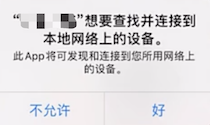

# API Example iOS

*[English](README.md) | 中文*

这个开源示例项目演示了声网 RTC SDK 的部分音频 API，帮助开发者理解和使用声网 RTC SDK。

## 问题描述
iOS 系统版本升级至 14.0 版本后，用户首次使用集成了声网 iOS 语音或视频 SDK 的 app 时会看到查找本地网络设备的弹窗提示。默认弹窗界面如下图所示：



[解决方案](https://docs.agora.io/en/api-reference/faq/integration/local_network_privacy)

## 环境准备

- Xcode 13.0 或更高版本
- iOS 真机设备
- 不支持模拟器

## 运行示例程序

这个段落主要讲解了如何编译和运行实例程序。

### 安装依赖库

进入当前示例目录，然后安装 CocoaPods 依赖。CocoaPods 的安装方式请参考[官方指南](https://guides.cocoapods.org/using/getting-started.html)。

```bash
cd iOS/APIExample-Audio
pod install
```

运行后确认 `APIExample-Audio.xcworkspace` 正常生成即可。

### 创建声网账号并获取 App ID

在编译和启动实例程序前，你需要首先获取一个可用的App Id:

1. 登录[声网控制台](https://dashboard.agora.io/signin/)并创建开发者账号
2. 前往后台页面，点击左部导航栏的 **项目 > 项目列表** 菜单
3. 复制后台的 **App Id** 并备注，稍后启动应用时会用到它
4. 如果开启了token，需要获取 App 证书并设置给`certificate`

5. 打开 `APIExample.xcworkspace` 并编辑 `KeyCenter.swift`，将你的 AppID 和 Certificate 分别替换到 `<#Your APPID#>` 与 `<#YOUR Certificate#>`

    ```
    /**
     声网为应用开发者分配 App ID，用于标识项目和组织。如果组织中有多个完全独立的应用，例如由不同团队构建，
     则应使用不同的 App ID。如果应用程序需要相互通信，则应使用同一个App ID。
     进入声网控制台(https://console.agora.io/)，创建一个项目，进入项目配置页，即可看到APP ID。
   */
    static let AppId: String = <# YOUR APPID#>

    /**
     声网提供 App Certificate 用于生成 Token。你可以在服务器部署 Token 生成服务，也可以使用控制台生成临时 Token。
     进入声网控制台(https://console.agora.io/)，创建一个带证书鉴权的项目，进入项目配置页，即可看到APP证书。如果项目没有开启证书鉴权，这个字段留空。
     注意：App证书放在客户端不安全，推荐放在服务端以确保 App 证书不会泄露。
    */
    static var Certificate: String? = <#YOUR Certificate#>
    ```

然后你就可以使用 `APIExample-Audio.xcworkspace` 编译并运行项目了。

## 联系我们

- 产品指南和 API 参考见[声网文档中心](https://doc.shengwang.cn/)
- 更多官方示例和社区项目见 [Shengwang Community](https://github.com/Shengwang-Community)
- 若遇到问题需要开发者帮助，你可以到 [开发者社区](https://rtcdeveloper.com/) 提问
- 如果需要售后技术支持，可以在[声网控制台](https://dashboard.agora.io)提交工单
- 如果发现了示例代码的 bug，欢迎提交 [issue](https://github.com/Shengwang-Community/API-Examples/issues)

## 代码许可

The MIT License (MIT)
